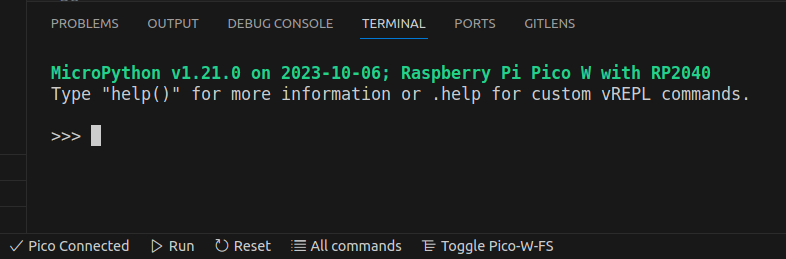

# Meet your new best friend: the REPL!

REPL stands for Read, Evaluate, Print Loop

In MicroPico we have direct access to the Pico's REPL. After connecting your pico by plugging it in to your computer, open the REPL by running any Python Script. (Use the Run button at the bottom of the VS Code window)



Screenshot of VS Code with MicroPico Configured

### Say Hi to your Pico!
Within the REPL, type the following and press enter:
```
print("Hello World")
```
Print statements are very helpful while programming, they allow the pico to communicate to you any number of things while running our scripts and eventually controlling the robot!

### Variable Types
Unlike C or C++, Python does not require you to explicitly declare the variable's type, it will infer the type as variables are assigned. Nevertheless, understanding the basics of variable types is where we will begin. 


#### Integers
Inside of your REPL, declare a couple of variables as integers by assigning them to whole numbers:
```
>>> x = 3
>>> y = 4
>>> z = 5
```
Now ask your pico to print the sum of the variables:
```
>>> print(x+y+z)
```

#### Shortcuts 
If you want to perform math on a single variable (such as `x = x + 3`): there are a number of shortcuts we can use:
```python
x += 4 #x = x + 4
x -= 4 #x = x - 4
x *= 4 #x = x*4
x /= 4 #x = x/4
x %= 4 #x = x % 4
```
Try any/all of these commands, print the variable `x` within the REPL to see the output!

#### Floats
Floats, or floating point variables are numbers with decimal places, I like to think of the floating point as the decimal point's ability to move around as needed by the situation. 

Let's use the REPL to make a couple floats:
```
>>> pi = 3.14159
>>> e = 2.718
```
Now lets challenge our Pico with some tough math:
```
>>> print(pi*e)
```
Unfortunately, our Pico is a master at floating point mathematics, and it can do it really fast! 

#### Strings
Strings are groups of characters, or groups of words:
```
>>> message = "I think I'm getting the hang of this"
>>> another = "Python is fun!"
```
Let's print them:
```
>>> print(message)
```
#### Pro Tip: Use `f` before a string to use a formatted string, Python will print the value of the variables within the `{}`
```
>>> print(f"x is {x}, y is {y}, and {another}")
```
As long as our Pico remains connected, our REPL will store any information we put into it!


## Let's make our first script!
Use `CTRL+Shift+E` to open the file explorer, click on the scripts directory, use the +file button to add a new file, name it `firstscript.py`


Make sure to save the new file!

Inside the file, let's make a bunch of variables and print statements:
```python
x = 5
y = 42
z = x+y

print(z)
```
To run the file, use the `Run` button at the bottom of VS Code, the output will print to the REPL. Change any of the variables and run it again. Play around with the different variable types and the syntax until you feel comfortable before moving on. 

### Comments
Any code that follows a `#` will be ignored, as it is `commented out`
Example:
```python
x = 5 #centimeters
```
comments can be incredibly helpful for storing information about what the code is doing or more information about a variable. 


## Logical Statements in Python
Now that we have the basics of variables down, let's use them! 

### If statements
In any programming language, the `If` statement checks if a condition is `True`, then executes the contents inside of the if statement. 

In Python the syntax is as follows:
```python
if (condition we are checking):
    code to execute
```
An example:
```python
if (y >= x):
    print(f"y + x = {z}")
``` 
When we run the script, the print statement will only execute `if` y is greater than equal to x

We have a number of options for logical conditions in programming:
```python
x >  y # greater than
x <  y # less than
x >= y # greater than or equal
x <= y # less than or equal 
x != y # not equal 
x == y # equal
```

### Checking equality
If we want to use an `if` statement to check if two variables are equal, use `==`. 

Using `=` sets the value of a variable, using `==` checks if two values are equal. 

An example:
```python
if (y == x):
    print("y and x are the same")
```

### Checking multiple things at once
If you have several if statements that involve the same variables, an If-Else statement will be easier to read and follow: use `elif` to check other conditions and `else` for if none of the conditions are satisfied. 

```python
x = 4
y = 10
z = x + y

if (y > x):
    print(z)
elif (y < x):
    print("y is smaller")
else:
    print("y and x are the same")
```
Play with the variables until you can get all the options to print! Also feel free to get creative:)

### Checking multiple conditions in one statement
If you want to check multiple conditions within one if statement, in python simply use `and` and `or` statements:

```python
if(x > y and y > 5):
    print("x must be greater than 5")

if(y > 4 or y < 10 and y!=6):
    print("y might be 5 but it's not 6")
```

## Loops
Let's say we want to execute a line of code multiple times. When programming we typically want to type as little as possible, and loops allow us to type the command once and it'll run for the number of times we want! 

### For loops
If we want a line of code to run for a specific number of times, we use a `for` loop. 

The syntax in Python is:

```python
for variable in list:
    code we want to execute
```
The variable tracks which value of the list we are in, we typically use `i`; the lists are typically numbers but python gives a lot of freedom. 

In our script, let's print the value of `i`, our variable, 5 times:
```python
for i in range(5):
    print(i)
```
as you can see from the output in the REPL, the `range()` function gives the numbers 1-5 in that order, if we wanted to use custom numbers, we can also make our own list:
```python
list = [0, 30, 60, 90, 120, 150, 180]
for i in list:
    print(i)
```

### While Loops
`While` loops execute code while a condition is `True`

The simplest while loop is known as the while-true loop. This loop will run until you press `Stop` or the Pico loses power. Try running this loop: 
```python
while(True):
    print("I'm gonna print forever")
```

`While` loops can stop on their own if the condition becomes false, but this technique is known as `blocking` because your program will be stuck in the while loop until the condition is false, so this practice  is not recommended. 

## Summary
In this guide, we covered basics of using the REPL within MicroPico in VS Code. You can now make all the scripts you want within the scripts folder! We also introduced print statements, variable types, if statements, for loops, and while loops. 
