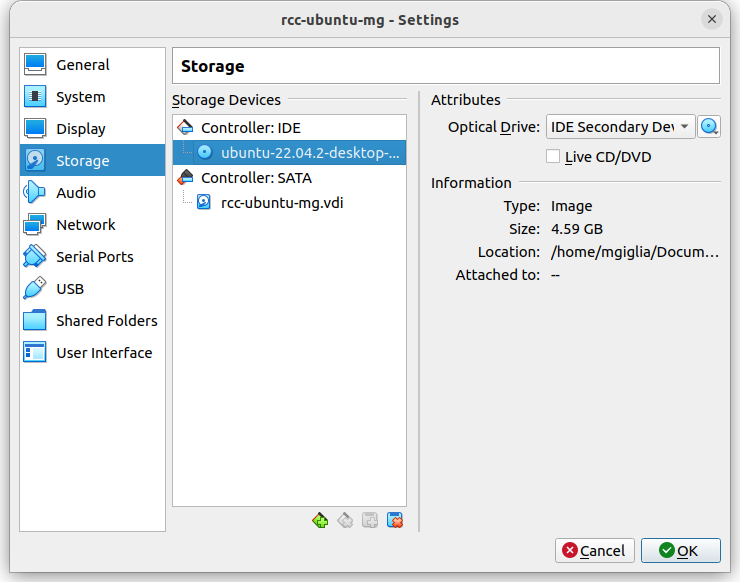

# **Setting up your Ubuntu Virtual Machine**

## **Configuring VirtualBox**
+ The first step in setting up your virtual machine is to download VirtualBox. It can be found here https://www.virtualbox.org/wiki/Downloads.

+ Download the VirtualBox 7.0.8 platform packages that pertain to your machine (most likely Windows hosts). VirtualBox allows us to utilize parts of our computer and direct them towards emulating a separate PC. If a computer generally has 8 processors for instance, VirtualBox can utilize 4 of the 8 to create a "separate" PC, that when combined with memory (RAM), and storage (HDD or SSD space) can imitate a separate computer.

+ Next we need to download the operating system we'd like to place on the VM (virtual machine). For RCC we'll be using Ubuntu 22.0.4. The .iso (image of data) can be found here https://releases.ubuntu.com/jammy/.


+ Once these two are downloaded, launch the VirtualBox application. Here, you'll want to create a new virtual machine. Name it as you wish, and select a folder to place the VM. Also, make sure the "Version" option is "Ubuntu (64-bit). Select the **.iso** you just downloaded and continue.

+ You'll now need to allocate resources to your Virtual Machine. Generally speaking, **at least 2GB (2000MB) of RAM and 4 CPU cores** are advised if you want the VM to run smoothly. Allocate as many as are reasonable for your hardware, just don't put too much.

+ Then you will create a "partition" for your Operating System to run on, **preallocating** the full-size would help with performance but isn't necessary (don't do this unless you have plenty of space to spare). Generally **aim for 30GB of space** or more

<!-- + Go into settings for the VM you've just created. We want to "insert" our CD of ubuntu which is the **.iso** you just downloaded. Under attributes is a small button with an image of a disk on it. Click that then add the **.iso** you downloaded. This way when you start up the VM, it will boot from the "CD" which is the installation CD for ubuntu22.04
 -->

+ In settings go to the display tab. Turn the "Video Memory" slider up to 128MB. Press OK.

## **Installing Ubuntu on the VM**
+ Press Start now for your new ubuntu VM and go through the installation process.
  
+ Next, create a username and password (of course, make these memorable!, also don't use spaces!). You can also add a hostname and domain name. Be sure to check the **Guest Additions** box, as this will allow you to copy and paste from your native machine onto the VM.

+ With that all done, you should be ready to finish up the set-up for your virtual machine, but there's one last thing you might want to change. Now that you've created a virtual machine, you can add video memory to it. That can be found in the main **VM manager screen**, to the right. The default is **16MB**, increase it to about half of what you have capacity for.

Now you're ready to launch the VM!

---

## **Getting Ubuntu to Work**
+ When you launch the VM, it'll automatically start the process of installing Ubuntu, once it finishes sign in.

+ Unfortunately, the setup process is not done yet. What follows is likely the most intimidating aspect of this install, but don't be scared! We now need to restart the VM. This is because when you first install the VM, the user you created doesn't have sudo permissions. In Linux, **sudo** basically means "admin", and without being an admin you're very limited in what you can do. *For those of you who may want proof, open up the terminal and type*:

```
sudo -v
```

+ To fix this, you need to **restart the VM (within Ubuntu, not the machine itself)**. **Once you see the VirtualBox logo, press down the shift button** to access advanced options for Ubuntu (Don't worry if you don't time it properly the first time, you can try as many times as you like!).

+ Select the **Advanced options for Ubuntu** line by using the **arrow keys** to move and pressing enter to select.

+ Now select the second option, **Ubuntu with Linux (....) (recovery mode)**

+ You'll now be hit with a **GUI** (graphical user interface) with a lot of options. Move down towards **root** and hit enter.

+ A terminal will open up at the bottom of the VM. Within this terminal, you must first enter your password, **the password you type won't appear on the bottom, but just write it out and hit enter**, and then type the following commands:

```
mount -o rw,remount /
usermod -aG sudo <your_username>
exit
```

+ Once that's done, hit enter, and you should boot into Ubuntu with sudo permissions!

+ Change the resolution of the display in the virtual machine. Press the "Windows" key while you're in the VM and search "Displays". Go into that setting and change the resolution to something a big larger. Don't go as big as your full screen if you want to be able to easily switch between the VM and your Host machine. I used 1400x900.

+ Finally, let's add guest additions so that we can copy and paste between the Host machine and the VM. In the VM at the menu bar at the top, click Devices and at the bottom it says "Insert Guest Additions CD Image". Let it download. It should show up on the left hand bar of your VM as a disk.

+ We need to install a couple packages. In a terminal run:
```
sudo apt install virtualbox-dkms virtualbox-guest-utils
```
+ Double click the CD image on the left, and then right click "autorun.sh". Press run as program, and it will install guest additions. After it finishes you will need to restart the VM. 

+ That's it, you're done! Thanks for following through the tutorial.


*Suggestion: Personally, I like to use my VM on scaled mode so I can fit it in my screen easily, but you can adjust the resolution to whatever you like in the view section. Just don't make it as large as your native resolution so that you can fit the entirety of the VM on your display!*


## Getting USB devices to pass into VM
+ Put your pico in boot mode and connect it to your PC
+ Go to settings for your VM and then the USB tab
  + Press the little green plus on the right side and click on "Pi Pico BOOT"
+ Place code on the pico such that it will infinitely print something to the serial terminal
  + Press the green plus again, look for "Pi Pico"
+ Reset the VM and now when you plug in the pico it should automatically connect to the VM

---

# **Setting up the Windows Subsytem for Linux (WSL)**

## **Installing WSL and Ubuntu**
Open up PowerShell as an administrator on your laptop.

In powershell, type: 
```powershell
wsl --install -d Ubuntu
```
This will install WSL and select Ubuntu as your Linux distro.

## **Opening Ubuntu**
+ In your search bar you can type: `Ubuntu`, an application called Ubuntu should show up. Once you click on it, a terminal with Ubuntu will open.
    + You can also open up `PowerShell` and type in `ubuntu`. 
+ From here, you can follow along with the `2-Pico-Env` guide as if you had a VM.